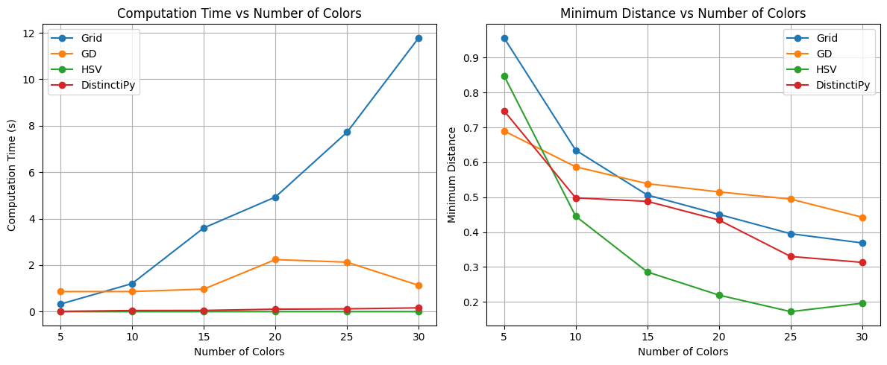

# Color Optimization Package

This package provides tools for generating well-distributed color palettes using various algorithms, with a focus on maximizing the minimum distance between colors in RGB space. It offers multiple approaches with different trade-offs between optimization quality and computational efficiency.

## Table of Contents

- [Installation](#installation)
- [Package Goals](#package-goals)
- [Optimization Methods](#optimization-methods)
- [Usage](#usage)
- [Examples](#examples)
- [Algorithms Comparison](#algorithms-comparison)
- [Performance Comparison](#performance-comparison)
- [License](#license)

## Installation

To install the package, clone the repository and install the package directly using:

```bash
pip install .
```

## Package Goals

The primary goal of this package is to generate visually distinct color palettes for data visualization, UI design, and other applications where color differentiation is important. The package:

- Maximizes the minimum distance between colors in RGB space
- Provides multiple optimization approaches with different trade-offs
- Supports constraints like fixed/prior colors
- Works in both 2D (for visual experimentation) and 3D color spaces
- Offers evaluation metrics and visualization tools
- Plans to add optimization and evaluation based on LAB color space using perceptual color difference metrics (CIEDE2000, CIE 1976, and other color comparison metrics)

## Optimization Methods

The package implements three main approaches for color optimization:

1. **Grid-based Sampling**: Uses farthest point sampling on a dense grid of points in RGB space
2. **Gradient Descent**: Directly optimizes point positions using gradient-based optimization
3. **HSV Sampling**: Samples colors evenly in the HSV color space

## Usage

### Basic Usage

```python
from coloropt.grid import farthest_point_sampling_rgb
from coloropt.gradient import optimize_points_3d
from coloropt.visualization import plot_color_list

# Generate 8 colors using grid sampling
grid_colors = farthest_point_sampling_rgb(n=8)

# Generate 8 colors using gradient descent
optimized_points = optimize_points_3d(n_colors=8)
gd_colors = convert_points_to_rgb(optimized_points)

# Visualize the resulting palette
plot_color_list(grid_colors, title="Grid Sampled Colors")
```

### Finding the Best Palette

```python
from coloropt.core import compare_and_select_best_palette

# Compare methods and automatically select the best palette
best_method, best_colors, metrics = compare_and_select_best_palette(
    n_colors=8,
    method_params={
        'grid': {'sample_size': 10000},
        'gd': {'alpha': 40.0, 'lr': 0.01, 'n_iters': 1500},
        'hsv': {'saturation': 0.85, 'value': 0.85}
    },
    criterion='min_dist'
)
```

## Examples

Check the `examples` directory for detailed usage examples:

- `color_gd_example.ipynb`: Demonstrates gradient descent optimization in both 2D and 3D spaces
- `color_comparison_example.ipynb`: Compares different optimization methods and their results
- `compare_with_distinctipy.ipynb`: Benchmarks our methods against the distinctipy package

## Algorithms Comparison

### Gradient Descent

**Pros:**
- Often produces the largest minimum distance between colors
- Directly optimizes the objective function
- Works well in both 2D and 3D spaces

**Cons:**
- Computationally expensive (O(n²) per iteration * number of iterations)
- Can get stuck in local minima
- Requires parameter tuning (learning rate, alpha, iterations)

### Grid-based Sampling

**Pros:**
- Generally produces good distributions
- More predictable results than gradient descent
- Simpler implementation

**Cons:**
- Most computationally expensive with complexity O(m·n²) where m is sample size and n is number of colors
- Quality depends on the grid density (sample size)
- Memory intensive for high-density grids
- Significantly slower than gradient descent for larger palettes

### HSV Sampling

**Pros:**
- Fastest method (O(n) complexity)
- Perceptually intuitive
- Works well for small palettes

**Cons:**
- Does not maximize minimum distance in RGB space
- Limited control over color distribution
- Less optimal for larger palettes

### When to Use Each Method

- **Gradient Descent**: When quality is critical and computation time is not a constraint
- **Grid Sampling**: For a good balance between quality and computation time when using moderate sample sizes
- **HSV Sampling**: When speed is paramount or when working with small palettes

## Performance Comparison

The following chart compares the minimum distance between colors for our different methods and the distinctipy package across varying palette sizes:



As shown in the chart, our gradient descent and grid-based sampling methods generally achieve larger minimum distances between colors compared to HSV sampling and distinctipy.

> **Note:** The grid approach's execution time increases linearly with the number of colors because the sample size was fixed in these benchmarks. There should be a way to optimize the sample size depending on the number of colors to achieve better performance-quality trade-offs.

> **Coming Soon:** Evaluation using perceptual color difference metrics including CIEDE2000 and CIE 1976 to better assess the performance of each method based on human color perception rather than simple Euclidean distances in RGB space.

## License

This package is distributed under the MIT License. See the [LICENSE](LICENSE) file for details.
